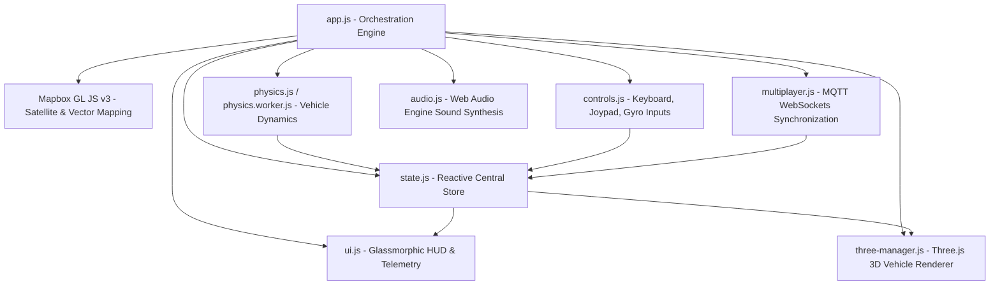

<div align="center">
  <a href="https://georide.milanwebportal.com">
    
  </a>
  <h1>GEO Ride - 3D Real World Driving Simulator</h1>
  <p>Drive sports cars, trucks, and buses anywhere on Earth in real-time 3D using real-world satellite maps.</p>

  <h2>
    <a href="https://georide.milanwebportal.com/play">START DRIVING NOW - FREE IN YOUR BROWSER</a>
  </h2>

  <p>
    <b>100% Free</b> &bull; <b>No Plugins</b> &bull; <b>No Downloads</b> &bull; <b>Real-time Multiplayer</b> &bull; <b>60+ FPS WebGL</b>
  </p>

  <p>
    <a href="https://github.com/milan-petkovski/GEO-Ride/actions/workflows/ci.yml">
      
    </a>
    <a href="https://georide.milanwebportal.com">
      
    </a>
    <a href="https://github.com/milan-petkovski/GEO-Ride/blob/main/LICENSE">
      
    </a>
  </p>

  <p><b>Supported Browsers:</b> Chrome, Edge, Safari, Firefox, Opera, Brave, Arc (Desktop, Tablet &amp; Mobile)</p>
</div>

---

## Quick Navigation

- [What is GEO Ride?](#what-is-geo-ride)
- [How to Play &amp; Controls](#how-to-play--controls)
- [Available Vehicles](#available-vehicles)
- [Map Modes](#map-modes)
- [Multiplayer Mode](#multiplayer-mode)
- [Mobile &amp; PWA Support](#mobile--pwa-support)
- [Technology &amp; Architecture](#technology--architecture)
- [Local Development Setup](#local-development-setup)
- [Author &amp; Support](#author--support)

---

## What is GEO Ride?

**GEO Ride** is a lightweight, high-performance 3D driving simulator that transforms the entire surface of planet Earth into your personal driving sandbox. Built with **Three.js** and **Mapbox GL JS**, it lets you:

1. **Drive Anywhere on Earth**: Navigate your home town, world capitals, mountain passes, or coastal highways using high-resolution satellite imagery and extruded 3D buildings.
2. **Realistic Vehicle Physics**: Enjoy responsive steering, authentic drift physics with visible tire skid marks, weight distribution, and launch control acceleration.
3. **Instant Multiplayer**: Create private or public rooms and cruise with friends across any continent without creating an account or logging in.
4. **Zero Install**: Runs entirely client-side in any modern web browser on PC, Mac, iPhone, iPad, and Android.

---

## How to Play & Controls

### Keyboard Controls (Desktop)

| Action                 |            Key / Control             | Details                                                   |
| :--------------------- | :----------------------------------: | :-------------------------------------------------------- |
| **Drive / Accelerate** |      **`W`** or **`Up Arrow`**       | Accelerates the vehicle forward                           |
| **Brake / Reverse**    |     **`S`** or **`Down Arrow`**      | Brakes smoothly or engages reverse gear                   |
| **Steer Left / Right** | **`A` / `D`** or **`Left / Right`**  | Precision wheel steering                                  |
| **Handbrake / Drift**  |            **`Spacebar`**            | Locks rear tires to initiate drifts and slides            |
| **Launch Boost**       | Hold **`Space` + `W`**, then release | Revs engine at standstill for rapid launch acceleration   |
| **Orbit Camera**       |       **`Left-Click + Drag`**        | Rotate and tilt view around your vehicle                  |
| **Reset Vehicle**      |               **`R`**                | Teleports vehicle back to the nearest safe road           |
| **Global Reset**       |           **`Shift + R`**            | Returns vehicle to initial spawn location                 |
| **Search Location**    |          Header Search Box           | Type any city, landmark, or address to teleport instantly |

### Mobile Controls (Touch & Tilt)

- **On-Screen Joypad**: Touch steering on the left side of the screen.
- **Gas & Brake Pedals**: Dedicated accelerator and brake buttons on the right side.
- **Gyroscope Tilt Steering**: Toggle device tilt in the Settings panel to steer by tilting your phone.
- **Haptic Feedback**: Subtle vibration on collisions and gear shifts (supported devices).

---

## Available Vehicles

| Vehicle              |     Class      | Handling Characteristics                                     | Best Used For                      |
| :------------------- | :------------: | :----------------------------------------------------------- | :--------------------------------- |
| **Sports Car**       |  Fast & Agile  | High acceleration, tight turning radius, responsive drifting | City street carving and drifting   |
| **Heavy Duty Truck** |    Momentum    | Heavier chassis, slower acceleration, authentic mass physics | Long-distance scenic road cruising |
| **Transit Bus**      | Long Wheelbase | Extended body requiring wide cornering arcs and precision    | Technical navigation challenges    |
| **God Mode**         |   Pro Ghost    | Zero collision detection, supersonic speed, map flight       | Rapid global exploration           |

---

## Map Modes

Switch seamlessly between four distinct real-world visual styles in the Settings menu:

<table align="center" width="100%">
  <tr>
    <td align="center" colspan="2" width="100%">
      
      <br />
      <b>Real-Time 3D Simulation &amp; World Scale Mapbox Engine (Gameplay View)</b>
      <br />
      <i>High-speed driving with dynamic vehicle physics and extruded 3D geometry</i>
    </td>
  </tr>
  <tr>
    <td align="center" width="50%">
      
      <br />
      <b>Satellite View</b>
      <br />
      <i>Photorealistic satellite imagery of Earth</i>
    </td>
    <td align="center" width="50%">
      
      <br />
      <b>Hybrid View</b>
      <br />
      <i>Satellite photos combined with road networks and street names</i>
    </td>
  </tr>
  <tr>
    <td align="center" width="50%">
      
      <br />
      <b>3D Buildings</b>
      <br />
      <i>Extruded architectural height models with physical collision detection</i>
    </td>
    <td align="center" width="50%">
      
      <br />
      <b>2D Vector Streets</b>
      <br />
      <i>High-contrast clean navigation map tuned for maximum framerates</i>
    </td>
  </tr>
</table>

---

## Multiplayer Mode

GEO Ride features an ultra-low-latency real-time multiplayer engine powered by **MQTT over secure WebSockets**:

1. Click the **Multiplayer** icon in the header.
2. Click **Copy Code** to share your unique session link or code with friends.
3. Your friends paste the code into the **Join** box to appear directly on your map in real-time.
4. Player positions, wheel angles, vehicle types, and skid marks synchronize smoothly at up to 60 updates per second.

---

## Mobile & PWA Support

GEO Ride is a fully compliant **Progressive Web App (PWA)**:

- **Full-Screen Immersion**: Install GEO Ride to your home screen on iOS (Share &rarr; Add to Home Screen) or Android (Install App prompt) for a clean borderless gaming experience.
- **Adaptive Orientation**: Play comfortably in landscape or portrait, with clear on-screen orientation guidance for mobile players.
- **Zero iOS Zoom Bug**: All form fields and dialogs use optimized touch sizing to prevent unwanted browser zooming on tap.

---

## Technology & Architecture



### Core Technologies

- **Rendering**: Three.js (r147) custom WebGL layer integrated into Mapbox GL JS (v3.3.0).
- **Physics**: Real-time vehicle dynamics with off-thread Web Worker physics calculations.
- **Audio**: Procedural Web Audio API sound synthesis (engine revs, braking, tire squeal, horn).
- **Network**: MQTT over secure WebSockets with client-side rate limiting and input sanitization.
- **Privacy & Compliance**: Google Consent Mode v2 with default denied analytics and an unobtrusive local consent banner.
- **Security**: Subresource Integrity (SRI) on external CDNs and hardened Content Security Policy.

---

## Local Development Setup

### Prerequisites

- **Node.js**: v20.0.0 or newer
- **npm**: v10.0.0 or newer

### Steps

1. **Clone the repository**:

    ```bash
    git clone https://github.com/milan-petkovski/GEO-Ride.git
    cd GEO-Ride
    ```

2. **Install dependencies**:

    ```bash
    npm install
    ```

3. **Configure Mapbox token**:
   Copy `.env.example` to `.env`:

    ```bash
    cp .env.example .env
    ```

    Add your valid Mapbox access token to `VITE_MAPBOX_TOKEN`.

    > _Tip: In your Mapbox account dashboard, add URL Restrictions to prevent token misuse._

4. **Start local dev server**:

    ```bash
    npm run dev
    ```

    Open `http://localhost:5173` in your browser.

5. **Run test suite**:
    ```bash
    npm test
    npm run lint
    npm run build
    ```

---

## Contributing & Changelog

- Detailed contribution guidelines, code standards, and PR workflows are documented in [CONTRIBUTING.md](CONTRIBUTING.md).
- Release history and version notes are tracked in [CHANGELOG.md](CHANGELOG.md).

---

## ☕ The Story & Support

Hi! I am Milan, a 20-year-old web developer and student from Serbia. I built **GEO Ride** to bring the magic of open-world 3D driving directly into the web browser with zero downloads, zero plugins, and 60+ FPS performance.

If you enjoy driving across the globe in GEO Ride and want to support my late-night coding sessions, you can buy me a coffee!

💖 [Support my work via PayPal](https://paypal.me/milanwebportal)

Every donation means a lot and directly supports Mapbox API quota, high-speed tile CDN costs, and continuous physics updates. Thank you!

---

## Author & Support

Created by **Milan Petkovski** &bull; Web Developer from Serbia.

- **Play GEO Ride**: [georide.milanwebportal.com](https://georide.milanwebportal.com)
- **Portfolio & Projects**: [milanwebportal.com](https://milanwebportal.com)
- **Contact**: [contact@milanwebportal.com](mailto:contact@milanwebportal.com)
- **Support the Project**: [Support via PayPal](https://paypal.me/milanwebportal)

_GEO Ride is 100% free and open-source under the MIT License._
